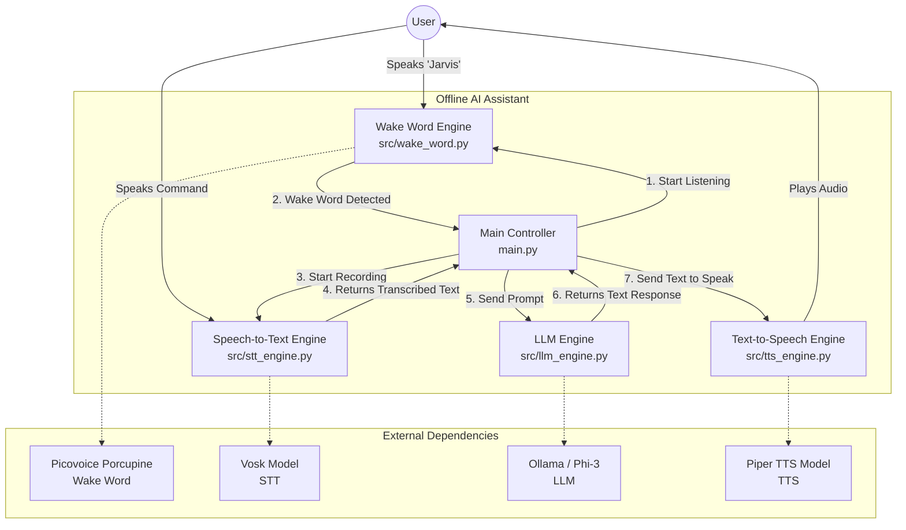
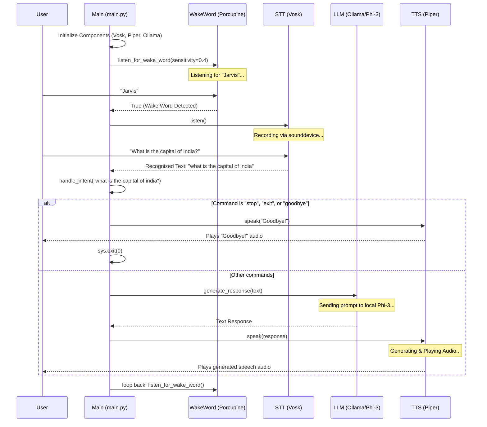
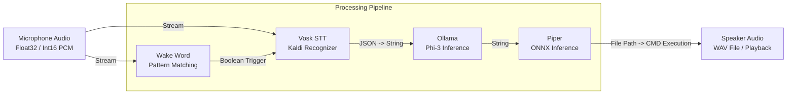

# Offline AI Assistant Architecture

This document contains detailed flowcharts explaining the architecture and execution flow of the Offline AI Assistant.

## 1. High-Level System Architecture

This flowchart shows the main components of the system and how they interact with each other.

---

## 2. Detailed Execution Flow

This sequence diagram illustrates the step-by-step execution flow from the moment the program starts to when an interaction finishes.

---

## 3. Data Flow Diagram

This diagram shows how data transforms as it moves through the system.

